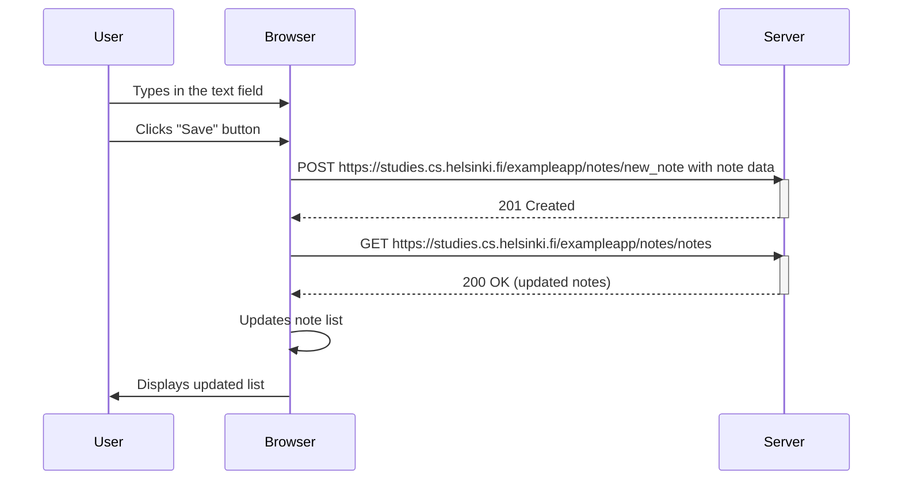

# Exercise 0.4 - Diagram

## Note Submission Flow Diagram

```mermaid
sequenceDiagram
    participant User as User
    participant Browser as Browser
    participant Server as Server

    User->>Browser: Types in the text field
    User->>Browser: Clicks "Save" button

    Browser->>Server: POST https://studies.cs.helsinki.fi/exampleapp/notes/new_note with note data
    activate Server
    Server-->>Browser: 201 Created
    deactivate Server

    Browser->>Server: GET https://studies.cs.helsinki.fi/exampleapp/notes/notes
    activate Server
    Server-->>Browser: 200 OK (updated notes)
    deactivate Server

    Browser->>Browser: Updates note list
    Browser->>User: Displays updated list
```
