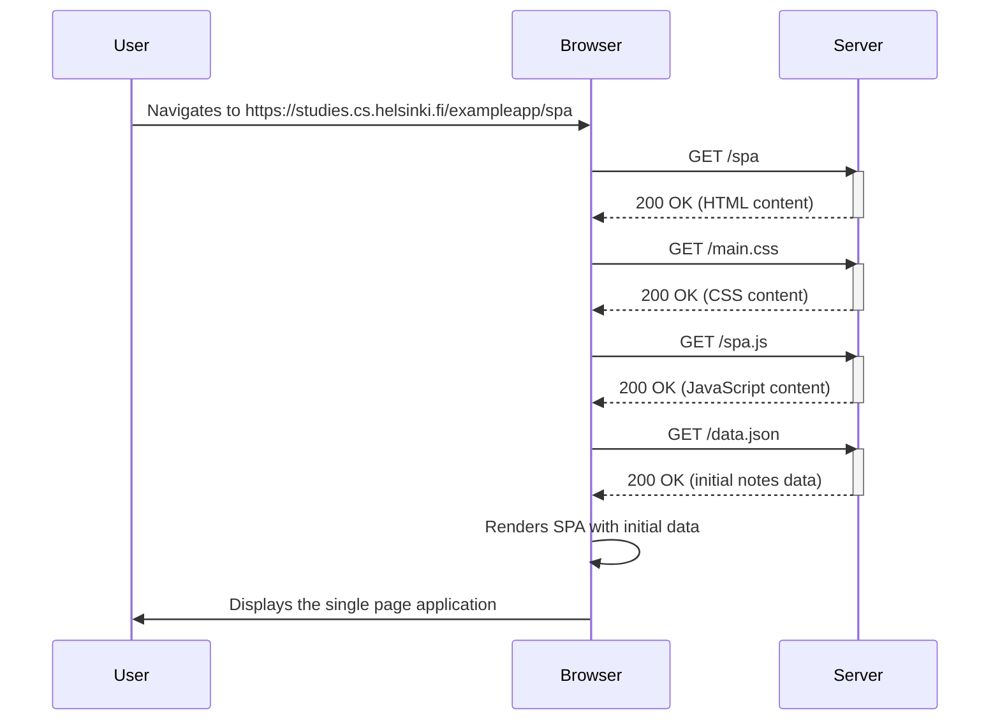

# Exercise 0.4 - Diagram

## Single Page Application (SPA) Access Flow Diagram

```mermaid
sequenceDiagram
    participant User as User
    participant Browser as Browser
    participant Server as Server

    User->>Browser: Navigates to https://studies.cs.helsinki.fi/exampleapp/spa

    Browser->>Server: GET /spa
    activate Server
    Server-->>Browser: 200 OK (HTML content)
    deactivate Server

    Browser->>Server: GET /main.css
    activate Server
    Server-->>Browser: 200 OK (CSS content)
    deactivate Server

    Browser->>Server: GET /spa.js
    activate Server
    Server-->>Browser: 200 OK (JavaScript content)
    deactivate Server

    Browser->>Server: GET /data.json
    activate Server
    Server-->>Browser: 200 OK (initial notes data)
    deactivate Server

    Browser->>Browser: Renders SPA with initial data
    Browser->>User: Displays the single page application
```
