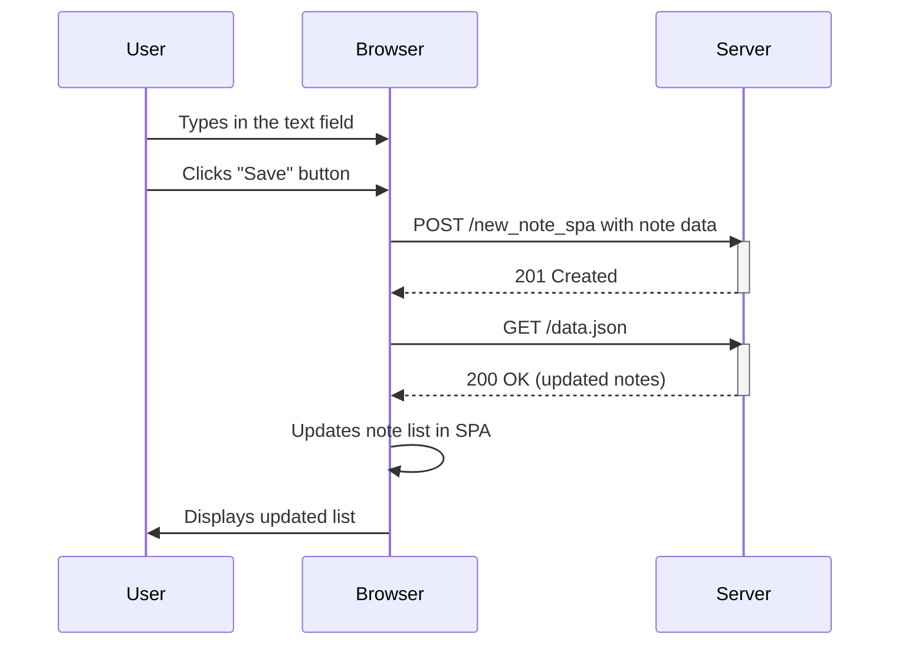

# Exercise 0.6 - Diagram

## Note Creation in Single Page Application (SPA) Flow Diagram

```mermaid
sequenceDiagram
    participant User as User
    participant Browser as Browser
    participant Server as Server

    User->>Browser: Types in the text field
    User->>Browser: Clicks "Save" button

    Browser->>Server: POST /new_note_spa with note data
    activate Server
    Server-->>Browser: 201 Created
    deactivate Server

    Browser->>Server: GET /data.json
    activate Server
    Server-->>Browser: 200 OK (updated notes)
    deactivate Server

    Browser->>Browser: Updates note list in SPA
    Browser->>User: Displays updated list
```
